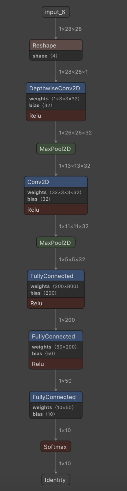
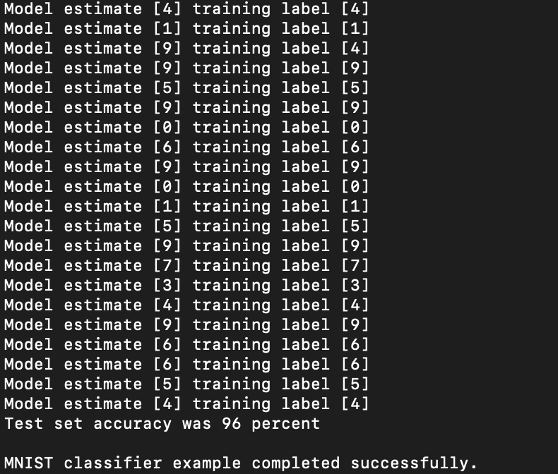

# Mnist_CNN_TFLite_Micro
Projet de Big Data et Technologies Embarquées

Ce projet a pour but d'implémenter un modèle de réseaux de neurones convolutionnel et d'utiliser ce modèle avec la librairie **Tensorflow Lite Micro** de **Google**. Pour cela, nous avons utilisé le dataset MNIST, comportant des chiffres manuscrits.

**Pré-requis:Avoir Tensorflow pour Python afin de tester les codes .py**

## Création du modèle

La première étape dans ce projet est de créer notre modèle en utilisant la libraire Tensorflow classique. Le modèle est défini dans le fichier [Tensorflow_mnist.py](https://github.com/PierreAmbeza/Mnist_CNN_TFLite_Micro/blob/master/Tensorflow_mnist.py).
Notre modèle est représenté de la façon suivante:

Ce fichier permet donc de créer notre modèle, de l'entraîner et enfin de sauvegarder ce modèle. Ici, deux versions sont sauvegardées:

1. [mnist_model.tflite](https://github.com/PierreAmbeza/Mnist_CNN_TFLite_Micro/blob/master/micro_mnist/model_mnist.tflite):ce fichier correspond à une version lite du modèle défini. C'est ce fichier que nous utiliserons par la suite pour TF Lite Micro
1. [mnist_model_quantized.tflite](https://github.com/PierreAmbeza/Mnist_CNN_TFLite_Micro/blob/master/micro_mnist/model_mnist_quantized__.tflite):ce fichier correspond à une version lite également mais avec une taille encore plus petite que **mnist_model.tflite**. Il est important d'avoir des modèles de taille la plus petite possible lorsque nous souhaitons les déployer sur des microcontroleurs.

## Test des modèles convertis

Une fois que nous avons converti nos modèles, il faut bien évidemment les tester. Le test s'effectue avec le fichier [TFLite_model_mnist.py](https://github.com/PierreAmbeza/Mnist_CNN_TFLite_Micro/blob/master/TFLite_model_mnist.py).
En exécutant ce fichier, nous pouvons constater que la précision reste la même pour **mnist_model.tflite** et quelle est légérement différente pour **model_mnist_quantized.tflite**

## Conversion de nos modèles .tflite en .cc

Nous venons de voir que nos modèles convertis sont bel et bien fonctionnels. Pour pouvoir tester ces modèles avec TF Lite Micro, nous devons enregistrer ces modèles au format **.cc**. Nous obtenons alors le fichier [mnist_model.cc](https://github.com/PierreAmbeza/Mnist_CNN_TFLite_Micro/blob/master/micro_mnist/model/mnist_model.cc)

**Remarque**:Le fichier **mnist_model_quantized.tflite** n'a pas été converti car à l'heure actuelle, il semble que TF Lite Micro ne supporte pas la quantification.

## Tester le projet

Afin de tester le projet, il faut suivre les instructions suivantes:

1. Cloner le dépot Github de Tensorflow via la commande suivante: git clone https://github.com/tensorflow/tensorflow-master
1. Ajouter le dossier **micro_mnist** de ce projet dans le répertoire **tensorflow-master/tensorflow/lite/micro/examples**
1. Placez vous ensuite dans le répertoire **tensorflow-master** et exécutez la commande suivante, qui créera un fichier binaire **micro_mnist** du projet :
  1. **make -f tensorflow/lite/micro/tools/make/Makefile micro_mnist**
1. Ensuite exécutez la commande suivante, en remplaçant le répertoire **votre_version**:
  1. **tensorflow/lite/micro/tools/make/gen/<votre_version>/bin/micro_speech**.
  En éxécutant le fichier binaire, vous devriez voir les prédictions faites par le modèle pour les données du fichier **mnist_test_data.h** et la précision de notre modèle. Cela s'affiche de la façon suivante:
  
